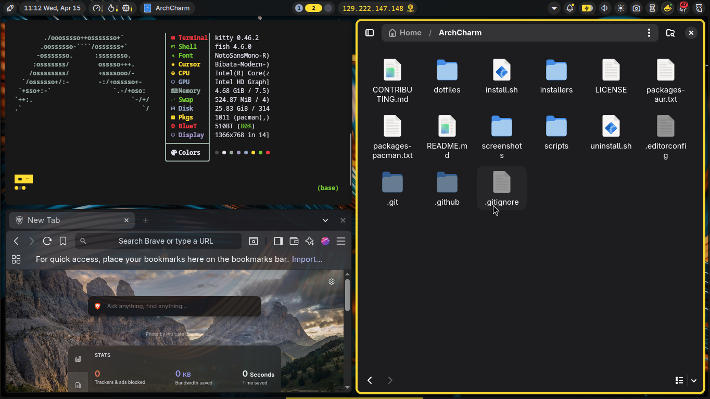
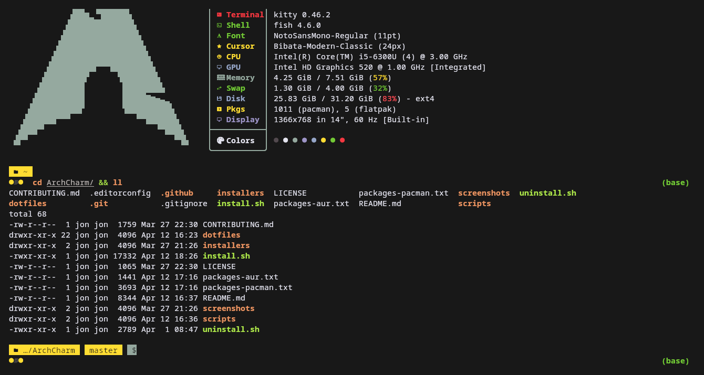
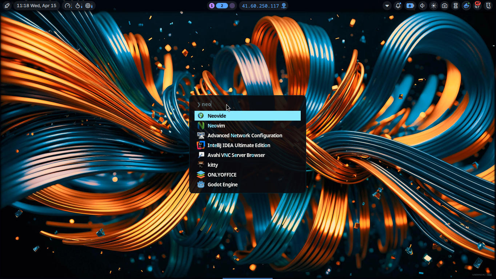

# ArchCharm

[](LICENSE)
[](https://archlinux.org)
[](https://github.com/YaLTeR/niri)
[](https://fishshell.com)
[](https://neovim.io)

> Opinionated, production-ready dotfiles for Arch Linux — built around the Niri scrollable tiling compositor with a warm Noctalia color palette.

## Preview

<!-- Replace with your actual screenshots -->
| Desktop | Terminal | Launcher |
|---------|----------|----------|
|  |  |  |

## What's Included

| Component | Application | Config Location |
|-----------|-------------|-----------------|
| Compositor | [Niri](https://github.com/YaLTeR/niri) | `~/.config/niri/` |
| Desktop Shell | [Noctalia](https://github.com/noctalia-dev/noctalia-shell) | `~/.config/noctalia/` |
| Shell | [Fish](https://fishshell.com) | `~/.config/fish/` |
| Prompt | [Starship](https://starship.rs) | `~/.config/prompt/` |
| Terminal (primary) | [Alacritty](https://alacritty.org) | `~/.config/alacritty/` |
| Terminal (secondary) | [Kitty](https://sw.kovidgoyal.net/kitty/) | `~/.config/kitty/` |
| Terminal (tertiary) | [Foot](https://codeberg.org/dnkl/foot) | `~/.config/foot/` |
| Editor | [Neovim](https://neovim.io) + LazyVim | `~/.config/nvim/` |
| App Launcher | [Fuzzel](https://codeberg.org/dnkl/fuzzel) | `~/.config/fuzzel/` |
| Lock Screen | [Swaylock](https://github.com/mortie/swaylock-effects) | `~/.config/swaylock/` |
| Power Menu | [Wlogout](https://github.com/ArtsyMacaw/wlogout) | `~/.config/wlogout/` |
| Audio Visualizer | [Cava](https://github.com/karlstav/cava) | `~/.config/cava/` |
| Git TUI | [Lazygit](https://github.com/jesseduffield/lazygit) | `~/.config/lazygit/` |
| File Manager | [Yazi](https://github.com/sxyazi/yazi) / [Ranger](https://ranger.github.io) | `~/.config/yazi/`, `~/.config/ranger/` |
| System Monitor | [Bottom](https://github.com/ClementTsang/bottom) | `~/.config/bottom/` |
| System Info | [Fastfetch](https://github.com/fastfetch-cli/fastfetch) | `~/.config/fastfetch/` |
| Multiplexer | [Tmux](https://github.com/tmux/tmux) | `~/.config/tmux/` |
| Media Player | [MPV](https://mpv.io) | `~/.config/mpv/` |
| Directory Jumper | [Zoxide](https://github.com/ajeetdsouza/zoxide) | Fish integration |
| Node Manager | [nvm.fish](https://github.com/jorgebucaran/nvm.fish) | Fish plugin |

## Color Scheme — Noctalia

The entire setup uses the **Noctalia** palette — a warm dark theme with orange, amber, and brown accents:

| Role | Hex | Preview |
|------|-----|---------|
| Background | `#291c14` |  |
| Foreground | `#f3f2f2` |  |
| Primary | `#ea9462` |  |
| Secondary | `#e7d24b` |  |
| Accent | `#aee74b` |  |
| Error | `#dd641e` |  |

## Requirements

- **Arch Linux** (or Arch-based distro with `pacman`)
- AUR helper (`yay` or `paru`) — installed automatically if missing
- Non-root user with `sudo` access
- Internet connection

## Installation

### Quick Install

```bash
git clone https://github.com/flow-pie/ArchCharm.git ~/ArchCharm
cd ~/ArchCharm
chmod +x install.sh uninstall.sh
./install.sh --all
```

### Unattended Install

```bash
ARCHCHARM_YES=1 ./install.sh --all
```

### Selective Install

```bash
./install.sh --fonts        # Fonts only
./install.sh --packages     # Packages only
./install.sh --dotfiles     # Dotfiles only
./install.sh --services     # Services only
./install.sh --all          # Everything
```

### Dotfiles Only (no package changes)

```bash
./install.sh --dotfiles
```

## Post-Install

1. **Reboot** your system: `sudo reboot`
2. **Select Niri** session from your display manager (or log in via TTY and run `niri`)
3. **Press `Mod+Shift+?`** to see the keybinding overlay

## Keybindings Reference

| Shortcut | Action |
|----------|--------|
| `Mod+Return` | Open terminal (Alacritty) |
| `Mod+Space` | App launcher (Fuzzel) |
| `Mod+C` | VS Code |
| `Mod+E` | File manager (Nautilus) |
| `Mod+B` | Browser (Brave) |
| `Mod+D` | Discord (Vesktop) |
| `Mod+Q` | Close window |
| `Mod+F` | Maximize column |
| `Mod+R` | Cycle column width presets |
| `Mod+V` | Toggle floating |
| `Mod+W` | Toggle tabbed display |
| `Mod+O` | Overview |
| `Mod+T` | Power menu (Wlogout) |
| `Mod+1-9` | Switch workspace |
| `Mod+Shift+E` | Quit Niri |
| `Super+Alt+L` | Lock screen |
| `Print` | Screenshot |
| `Mod+H/J/K/L` | Focus left/down/up/right |

## Project Structure

```
ArchCharm/
├── install.sh              # Main installer
├── uninstall.sh            # Symlink removal
├── packages-pacman.txt     # Official repo packages
├── packages-aur.txt        # AUR packages
├── README.md               # This file
├── LICENSE                 # MIT License
├── CONTRIBUTING.md         # Contribution guidelines
├── dotfiles/
│   ├── niri/               # Niri compositor config
│   ├── fish/               # Fish shell config + functions
│   ├── alacritty/          # Alacritty terminal + themes
│   ├── kitty/              # Kitty terminal + themes
│   ├── foot/               # Foot terminal + themes
│   ├── nvim/               # Neovim (LazyVim) config
│   ├── noctalia/           # Noctalia desktop shell
│   ├── fastfetch/          # System info display
│   ├── fuzzel/             # App launcher
│   ├── swaylock/           # Lock screen
│   ├── wlogout/            # Power menu
│   ├── cava/               # Audio visualizer
│   ├── lazygit/            # Git TUI
│   ├── bottom/             # System monitor
│   ├── tmux/               # Terminal multiplexer
│   ├── mpv/                # Media player
│   ├── yazi/               # File manager
│   ├── ranger/             # File manager (alt)
│   ├── starship/           # Prompt config
│   └── walker/             # Walker launcher theme
└── screenshots/            # Preview images
```

## Customization

### Change Wallpaper

```bash
swaybg -i ~/Pictures/your-wallpaper.png -m fill
```

To persist, edit `~/.config/niri/autostart.sh`.

### Change Theme

Each terminal has multiple Noctalia theme variants in its `themes/` directory. Edit the import/include line in the main config to switch.

### Add Waybar Modules

Waybar uses modular JSONC files in `~/.config/waybar/modules/`. Add new module files and reference them in `config.jsonc`.

## Uninstall

```bash
./uninstall.sh
```

This removes all symlinks created by the installer. Backups (if any) are preserved in `~/.config/archcharm-backup-*`.

## Troubleshooting

**Niri won't start:**
- Ensure you have a working Wayland session: `niri --version`
- Check XDG portals: `systemctl --user status xdg-desktop-portal`

**Fish errors on startup:**
- Run `fish -c 'fisher list'` to check plugin status
- Reinstall Fisher: `curl -sL https://raw.githubusercontent.com/jorgebucaran/fisher/main/functions/fisher.fish | source && fisher update`

**Fonts look wrong:**
- Rebuild font cache: `fc-cache -fv`
- Verify Nerd Fonts are installed: `fc-list | grep -i nerd`

**Noctalia shell not loading:**
- Ensure `qs` (Quickshell) is installed: `qs --version`
- Check: `qs -c noctalia-shell`

## Contributing

See [CONTRIBUTING.md](CONTRIBUTING.md) for guidelines.

## License

MIT License — see [LICENSE](LICENSE) for details.

---

<p align="center">
  <b>ArchCharm</b> — Crafted for Arch Linux
</p>
